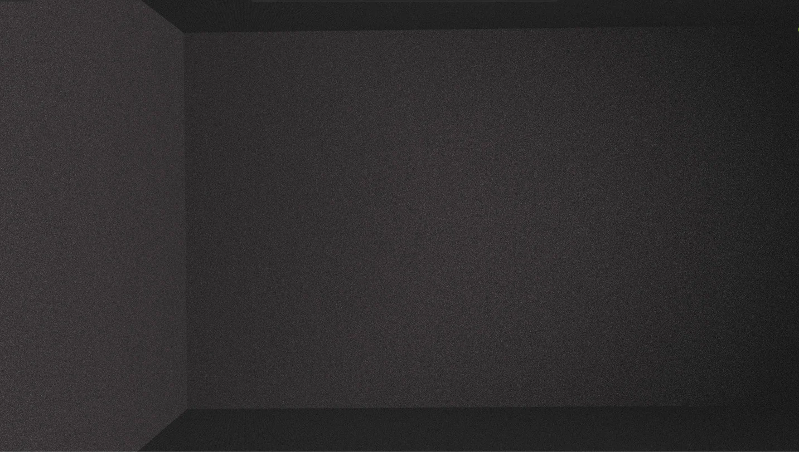

# BenCut

Editor de vídeo web local com interface no navegador e processamento via FFmpeg. Roda inteiramente na sua máquina — sem nuvem, sem instalação complexa.



## Funcionalidades

- **Timeline multi-faixa** — vídeo, N faixas de áudio e N faixas de imagem
- **Corte preciso** — detecta e recodifica bordas mid-GOP automaticamente
- **Aceleração / desaceleração** — 0.25× a 3× por segmento
- **Volume e opacidade** por segmento com preview ao vivo
- **Texto** sobre o vídeo (posição livre, exportado via `drawtext`)
- **Transição** fade-preto nas emendas
- **Converter** para MP4 ou WebM (GPU via NVENC quando disponível)
- **Extrair áudio** de qualquer vídeo
- **Projetos .evp** — salva e retoma edições
- **Gravação de tela** — captura via API do GNOME com overlay flutuante de parada
- **Media pool** com thumbnails, preview por clique e menu de contexto (renomear/deletar)
- Suporte a aceleração NVENC (NVIDIA)

## Requisitos

- Python 3.10+
- FFmpeg — recomendado [BtbN n7.1](https://github.com/BtbN/FFmpeg-Builds/releases) em `~/.local/bin/ffmpeg`
- `zenity` — seletor de arquivo nativo (`sudo apt install zenity`)
- `python3-gi` e `python3-dbus` — para gravação de tela (`sudo apt install python3-gi python3-dbus gir1.2-gtk-3.0`)
- GNOME com Wayland + XWayland — para `screen_select.py` e `rec_overlay.py`

## Como rodar

```bash
git clone https://github.com/jardim2d/bencut
cd bencut
./run.sh
```

O navegador abre automaticamente em `http://localhost:8765`.

## Gravação de tela

O painel **Gravar** (ícone na barra lateral) usa a API `org.gnome.Shell.Screencast` — funciona apenas em sessões GNOME. Ao iniciar a gravação, um botão flutuante aparece na tela para parar a qualquer momento sem precisar voltar ao BenCut.

## Licença

MIT — veja [LICENSE](LICENSE).
